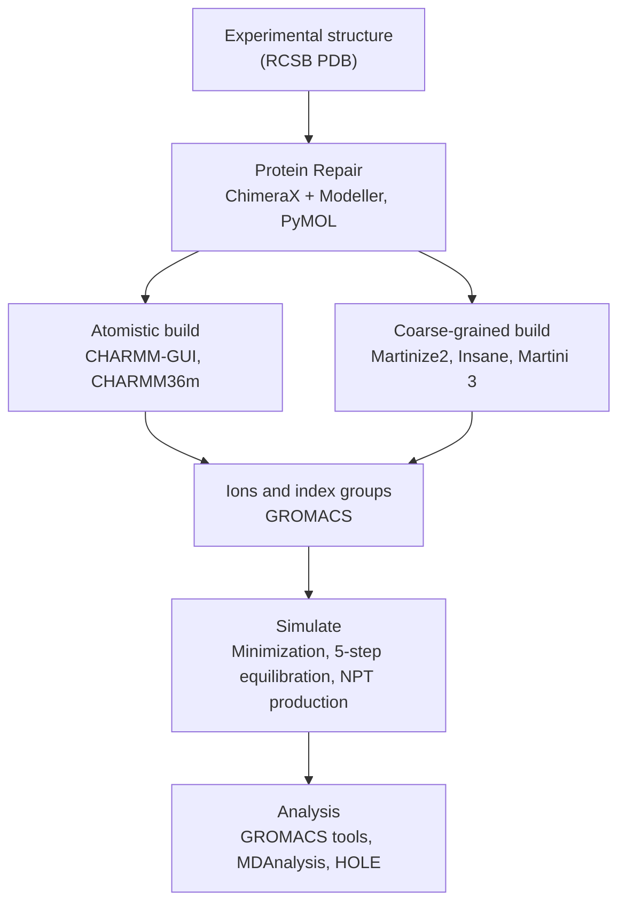

<!-- Title, overview, and badges. -->
<div align="center">

  

  <h1>GIMLET: GROMACS Ion-channel Multiscale Library: Examples & Tools</h1>

  <p>
    A repository for a streamlined and reproducible method of ion channel simulation and analysis through atomistic and coarse grained means in GROMACS.
  </p>
  
  <p>
    <a href="https://github.com/zamydm/GIMLET/graphs/contributors">
      
    </a>
    <a href="https://github.com/zamydm/GIMLET/commits/main">
      
    </a>
    <a href="https://github.com/zamydm/GIMLET/issues">
      
    </a>
  </p>

</div>

<!-- Table of Contents -->
## :notebook_with_decorative_cover: Table of Contents
- [Overview](#overview)
- [Software Guide](#software-guide)
  * [CHARMM-GUI](#charmm-gui)
  * [CHARMM36](#charmm36)
  * [ChimeraX](#chimerax)
  * [GROMACS](#gromacs)
  * [Hole2](#hole2)
  * [Insane](#insane)
  * [Martini3](#insane)
  * [MDAnalysis](#mdanalysis)
  * [Modeller](#modeller)
  * [PyMol](#pymol)
  * [Vermouth-Martinize2](#vermouth-martinize2)
- [Simulation Guide](#simulation-guide)
  * [Protein Repair](#protein-repair)
  * [Atomistic](#atomistic)
  * [Coarse Grain](#coarse-grain)
  * [Simulate](#simulate)
  * [Analysis](#analysis)
- [Contact](#contact)
- [References](#references)

## Overview

GIMLET is a complete, reproducible workflow for simulating a membrane-embedded ion channel in GROMACS, from an experimental structure to publication-ready analysis. It covers every stage in between — repairing the structure, building the membrane system, running minimization, equilibration, and production, and analysing the resulting trajectories — and does so at two resolutions:

- **Atomistic** simulations in the CHARMM36m force field resolve individual side chains, hydrogen bonds, and pore hydration. They are the reference for structural detail, but their cost limits them to hundreds of nanoseconds for a system the size of a membrane-embedded channel.
- **Coarse-grained** simulations in the Martini 3 force field represent roughly four heavy atoms as a single bead, reaching microsecond timescales at a fraction of the cost. They capture slower processes, such as large-scale conformational change and lipid redistribution around the channel, that atomistic runs cannot sample.

The two resolutions are built from the same repaired structure, placed in matching membranes, and analysed with the same notebooks, so their results can be compared directly.

The workflow is designed around a **grid of simulation conditions**, such as a set of temperatures at each of several salt concentrations. Each condition is built and equilibrated as an independent system, and the analysis identifies which structural features — residue flexibility, pore dimensions, residue–residue contacts, lipid binding — respond to the scanned variables. Nothing in it is specific to one channel: structure names, box dimensions, lipid compositions, ion counts, and residue numbering are all left as inputs, and every channel-specific value used by the analysis is defined in a single configuration file.

This repository additionally contains a sample of the ChACRA analysis scripts as used [here](https://pubs.acs.org/jctcce/article/20/19/8711/168981/Illuminating-Protein-Allostery-by-Chemically) on the protein TRPV1. The file **TRPV1-ChACRA** contains scripts and sample data for conducting further contact analysis as needed.

### Workflow



The [Simulation Guide](#simulation-guide) follows this diagram from top to bottom:

1. **[Protein Repair](#protein-repair)** models the loops missing from the experimental structure and produces a single, gap-free structure used by both resolutions.
2. **[Atomistic](#atomistic)** builds the all-atom membrane system in CHARMM-GUI and finishes it in GROMACS with ions and index groups.
3. **[Coarse Grain](#coarse-grain)** maps the structure to Martini 3, equilibrates the protein in solvent, inserts it into a matching bilayer, and adds ions and index groups.
4. **[Simulate](#simulate)** runs the same minimization, equilibration, and production sequence at either resolution, with the parameters for each laid out step by step.
5. **[Analysis](#analysis)** computes RMSD, RMSF, radius of gyration, pore profiles, residue contact networks, contact-mode (ChACRA) analysis, and lipid interactions across the condition grid.

### Before you start

Working through the full workflow requires:

- **A CHARMM-GUI account** to build the atomistic membrane system.
- **A Modeller license key**, which is free for academic use, to model missing loops through ChimeraX.
- **A GROMACS installation on a GPU-equipped cluster.** Production runs of hundreds of nanoseconds (atomistic) and several microseconds (coarse grained) per condition are impractical on a workstation, and the commands in this guide are written for a Slurm scheduler with an MPI build of GROMACS.
- **A Python environment** for Martinize2, Insane, and the analysis notebooks.
- **HOLE**, installed separately, for pore analysis.

The [Software Guide](#software-guide) below describes what each program does in the workflow and what to watch for when setting it up. For reproducibility, record the version of each program used alongside your results — force field ports, Martinize2 defaults, and GROMACS `.mdp` behaviour have all changed between releases.

## Software Guide

The table summarizes where each program enters the workflow. The entries that follow describe what it is used for and the practical points that matter when following this methodology.

| Software | Stage | Used for |
|---|---|---|
| [ChimeraX](#chimerax) + [Modeller](#modeller) | Protein Repair | Modelling missing loops |
| [PyMOL](#pymol) | Protein Repair, Analysis | Merging repaired chains; visual checks; mapping results onto the structure |
| [CHARMM-GUI](#charmm-gui) | Atomistic build | Membrane orientation, bilayer construction, solvation, GROMACS inputs |
| [CHARMM36](#charmm36) | Atomistic build, Simulate | All-atom force field |
| [Vermouth-Martinize2](#vermouth-martinize2) | Coarse-grained build | Mapping the protein to Martini 3 and writing its topology |
| [Insane](#insane) | Coarse-grained build | Solvating the protein; building the coarse-grained bilayer |
| [Martini3](#martini3) | Coarse-grained build, Simulate | Coarse-grained force field |
| [GROMACS](#gromacs) | Every stage after building | Ions, index groups, simulation, trajectory processing, basic analysis |
| [MDAnalysis](#mdanalysis) | Analysis | Trajectory reading, contact and distance calculations |
| [Hole2](#hole2) | Analysis | Pore radius profiles |
| [Python Analysis Stack](#python-analysis-stack) | Analysis | Running the analysis notebooks |

### CHARMM-GUI
[CHARMM-GUI](https://charmm-gui.org/) is a web-based platform for building molecular systems and generating simulation inputs for a range of MD engines. In this workflow, its **Membrane Builder** constructs the atomistic system: it orients the repaired channel in the membrane using the PPM 2.0 server, builds an asymmetric bilayer of the chosen lipid composition around it, hydrates the pore, solvates the box, and writes a complete set of GROMACS inputs.

That output includes the CHARMM36m force field files, the system topology, and a series of equilibration `.mdp` files whose position-restraint definitions (`POSRES_FC_BB`, `POSRES_FC_SC`, `POSRES_FC_LIPID`, `DIHRES_FC`) are the ones the [Simulate](#simulate) section relaxes step by step.

Practical points:

- An account is required, and building a large channel system can take from several minutes to hours at each stage of the builder.
- A completed job cannot be reopened and modified. Any change to the input means rebuilding from the start, which is why this workflow adds no salt in CHARMM-GUI and instead adds ions afterwards with `gmx genion`. One CHARMM-GUI build then serves every ionic condition.
- Specify lipids by number rather than by ratio, so that the box can be driven to the target size while keeping the two leaflets equal in area.

### CHARMM36
[CHARMM36m](https://mackerell.umaryland.edu/charmm_ff.shtml) is the all-atom additive force field used for the atomistic simulations, together with the CHARMM-modified TIP3P water model. CHARMM36m refines the CHARMM36 protein parameters for better balance between folded and disordered states, and the CHARMM36 lipid parameters are among the most extensively validated for membrane simulation.

CHARMM-GUI writes the GROMACS port of the force field into the system it builds, so no separate download is needed when following this workflow. If you build a system by other means, the GROMACS port is available from the MacKerell lab website linked above.

The force field is parameterized for particle-mesh Ewald electrostatics and specific van der Waals cutoff treatment; changing these settings changes membrane properties such as area per lipid. The settings used in this workflow are listed under [Atomistic parameters](#atomistic-parameters) in the Simulate section.

### ChimeraX
[ChimeraX](https://www.cgl.ucsf.edu/chimerax/) is a molecular visualization and analysis program from UCSF. In this workflow, it provides the interface to Modeller for repairing the experimental structure.

The `seq chain` command displays each chain's sequence with unresolved residues marked, and **Tools → Sequence → Model Loops** sends the gaps to Modeller, either through the UCSF web service or a local Modeller installation. Both routes require a Modeller license key, which ChimeraX prompts for. The number of models generated and the choice of the best-scoring model by zDOPE are set in the same dialog.

A multi-chain assembly can exceed what a web-service job will handle, in which case repair each chain separately and merge the results in PyMOL.

### GROMACS
[GROMACS](https://www.gromacs.org/) is the molecular dynamics engine for the entire workflow after system building. It is used to:

- **Finish system preparation**, adding ions with `gmx genion` and building index groups with `gmx make_ndx`.
- **Run every simulation**, preparing each stage with `gmx grompp` and running it with `gmx mdrun`.
- **Process trajectories**, centring the protein and making molecules whole with `gmx trjconv`.
- **Produce the basic analysis inputs**, using `gmx rms`, `gmx rmsf`, `gmx gyrate`, and `gmx energy`.

Practical points:

- The simulation commands in this guide use `gmx_mpi` launched with `srun`, for an MPI build on a Slurm cluster. On a workstation with a standard build, use `gmx` and drop `srun`.
- A GPU-accelerated build is strongly recommended. Long production runs will exceed typical wall-time limits and must be restarted from checkpoints, as described in [Simulate](#simulate).
- `.mdp` options and defaults change between GROMACS releases; for example, recent versions warn about the Berendsen barostat used in coarse-grained equilibration. Use one GROMACS version for every system in a study, and record it.

### Hole2
[HOLE](https://www.holeprogram.org/) calculates the radius of an ion channel's pore as a function of position along the conduction pathway, by fitting the largest sphere that can pass through the protein at each point. Its source is on [GitHub](https://github.com/osmart/hole2). The narrowest point of the resulting profile determines whether an ion can pass, making HOLE the most direct structural measure of whether a gate is open.

In this workflow, HOLE is driven from Python through `mdahole2`, an MDAnalysis extension that runs HOLE on every frame of a trajectory and collects the profiles. `mdahole2` is only a wrapper: the HOLE executable must be installed separately and be on `PATH`, or be pointed to with the `HOLE_EXECUTABLE` environment variable.

HOLE assigns atomic radii by atom name from all-atom radius tables, so pore analysis applies to the atomistic simulations only.

### Insane
[Insane](https://github.com/Tsjerk/Insane) (INSert membrANE) builds coarse-grained systems by placing a protein in a lipid bilayer and filling the box with solvent. It is used twice in this workflow:

- **To solvate the coarse-grained protein on its own** in a water box, so that strain introduced by the mapping can be relaxed before the protein is placed in a membrane.
- **To insert the equilibrated protein into the bilayer.** Insane builds each leaflet separately, allowing an asymmetric membrane that matches the atomistic system.

Practical points:

- Lipids that are not in Insane's built-in library can be defined on the command line from their bead topology (`-alname`, `-alhead`, `-allink`, `-altail`).
- Insane adds only NaCl, so salt is set to zero at insertion and all ion species are added afterwards with `gmx genion`, as in the atomistic workflow.
- Always check the orientation of the protein in the finished bilayer before continuing. An inverted or tilted insertion will not correct itself during equilibration.

### Martini3
[Martini 3](https://cgmartini.nl/) is the coarse-grained force field for the coarse-grained simulations. It maps, on average, four heavy atoms and their hydrogens to a single interaction site. Its non-bonded interactions are parameterized mainly against experimental partitioning free energies between polar and apolar phases, and its bonded interactions against reference all-atom simulations. The reduced number of particles and the smoother energy landscape allow a 20 fs timestep and microsecond-scale simulations, which is what makes the coarse-grained branch of this workflow useful for slow processes.

Practical points:

- The force field, lipid, and ion `.itp` files are downloaded from the Martini website and must be included in the system topology alongside the protein topology from Martinize2.
- Species not distributed with the force field, such as a second monovalent cation, need their own molecule type defined in an `.itp` file; an example is given in [Coarse Grain](#coarse-grain).
- Martini proteins do not maintain their tertiary structure without help; an elastic network, added by Martinize2, holds the fold. This also means that large-scale protein conformational change in coarse-grained simulations is limited by the elastic network, and conclusions about it should be checked against the atomistic simulations.

### MDAnalysis
[MDAnalysis](https://www.mdanalysis.org/) is a Python library for reading and analysing MD trajectories in most common formats, including GROMACS `.gro`, `.pdb`, `.tpr`, and `.xtc`. It is the foundation of the contact, lipid, and pore analysis notebooks, providing:

- Atom selections, such as the protein, a lipid species, or backbone atoms.
- Periodic-boundary-aware distance calculations, with cutoff-capped neighbour searches (`capped_distance`) that make residue contact networks over long trajectories affordable.
- The interface that `mdahole2` uses to run HOLE frame by frame.

MDAnalysis reports distances in ångström, not GROMACS's nanometres, and the notebooks follow this convention throughout.

### Modeller
[Modeller](https://salilab.org/modeller/) builds protein structures by satisfaction of spatial restraints, and in this workflow it models the loops that are unresolved in the experimental structure. It is run through ChimeraX rather than directly, and requires a license key, which is free for academic users and obtained by registering on the Modeller website.

Modeller generates several candidate models for each set of gaps. Generate as many as practical, since more models sample loop conformations more thoroughly, and select the one with the most negative zDOPE score, Modeller's normalized statistical assessment of model quality. Model only gaps internal to the chain; disordered termini generally should not be invented.

### PyMOL
[PyMOL](https://pymol.org/) is a molecular visualization program, and in this workflow it is used in three places:

- **Protein Repair**, to merge separately repaired chains into a single structure.
- **Visual checks** throughout the build, such as confirming the protein's orientation in the membrane and inspecting modelled loops.
- **Analysis**, to display results mapped onto the structure. The RMSF-variability and pore-surface files written by the analysis notebooks store their values in the B-factor column, so `spectrum b` colours the structure by them.

### Python Analysis Stack
The analysis is run as Jupyter notebooks that depend on NumPy, SciPy, Matplotlib, pandas, seaborn, MDAnalysis, and `mdahole2`, all listed in the repository's `requirements.txt`. Every notebook reads its channel-specific settings — protomer count, condition grid, residue numbering, and domain boundaries — from a shared `channel_config.py`, and can be run in a demo mode on synthetic data to check the environment before real trajectories are used. Setup is described at the start of the [Analysis](#analysis) section.

Using a single environment for Martinize2, Insane, and the analysis is convenient, but keep it isolated (for example with `venv` or conda) so that package versions can be recorded and reproduced.

### Vermouth-Martinize2
[Martinize2](https://github.com/marrink-lab/vermouth-martinize) converts an atomistic protein structure into its coarse-grained Martini 3 representation, writing both the coarse-grained coordinates and the protein topology. It is built on [Vermouth](https://vermouth-martinize.readthedocs.io/en/latest/index.html) (VERsatile, MOdular, and Universal Tranformation Helper), a Python library for topology generation, and is installed with it.

## Simulation Guide 

The workflow below is written to be channel-agnostic. All structure names, file names, box dimensions, lipid counts, and ion counts are placeholders written as `<...>` or as generic names such as `protein.pdb` and `system.gro`. Substitute the values appropriate to the channel and membrane environment being studied.

The pipeline has three stages that share a common starting point: a repaired protein structure is prepared once, then built into either an atomistic system, a coarse-grained system, or both.

### Protein Repair

Experimental structures of ion channels are frequently missing loops, termini, and side chains. These gaps must be modeled before the structure can be simulated or else the results will be flawed. While my methodology is built upon the usage of modeller, more modern softwares like AlphaFold are equally if not more viable.

**1. Obtain the structure**

Download the most complete and highest-resolution experimental structure of the channel available from the [RCSB PDB](https://www.rcsb.org/). Where several depositions exist, prefer the most recent one with the fewest unresolved residues and the conformational state of interest (for example open, closed, or desensitized). This selection method will ensure the highest accuracy of simulation to real physiological conditions.

**2. Identify missing regions in ChimeraX**

Open the structure and display the sequence for each chain to locate unresolved residues:

```
seq chain /A
```

Repeat for each chain in the assembly. For a homomultimeric channel, the same gaps usually appear in every subunit, and each subunit can be repaired independently.

**3. Model the missing loops**

Use `Tools → Sequence → Model Loops` to call Modeller through ChimeraX, with the following settings:

- Model only the internal structure — that is, the unresolved regions internal to the chain rather than the disordered termini, which generally should not be invented as these regions are largely nonphysical.
- Keep one adjacent flexible residue on each side of the gap so that the modeled loop can be joined to the resolved structure without strain. Leaving strain within the simulation can cause simulations to crash prematurely.
- Set the number of models as high as can be generated without the ChimeraX session disconnecting. More models means better sampling of loop conformations.
- Select the model with the most negative zDOPE score, which is the best-scoring model by Modeller's statistical potential.
- Save the selected model as a `.pdb` file.

**4. Merge separately modeled chains**

If loops were modeled chain by chain, the resulting structures must be recombined into a single file. In PyMOL:

```
load chain_a.pdb
load chain_b.pdb
select all
save repaired_protein.pdb
```

PyMOL saves to the home directory by default unless a full path is given.

**5. Clean the structure**

Remove `HETATM` records — crystallographic waters, detergents, co-purified lipids, ligands, and ions — unless a given heteroatom is explicitly part of the intended model. These records are a common source of atom clashes and of parameterization failures later in the pipeline.

The output of this stage is a single, gap-free `repaired_protein.pdb` used as the input for both the atomistic and the coarse-grained branches below.

### Atomistic

The atomistic branch uses CHARMM-GUI to build and equilibrate a membrane-embedded system in the CHARMM36 force field, then finishes system preparation in GROMACS.

#### Building the membrane system in CHARMM-GUI

Upload `repaired_protein.pdb` to the CHARMM-GUI Membrane Builder and work through the builder with the following considerations.

**Protonation.** The default pH of 7.00 is appropriate for a physiological system unless the study specifically targets pH-dependent gating.

**Orientation.** Use PPM 2.0 to orient the protein relative to the bilayer normal. This places the transmembrane region in agreement with hydrophobic-belt expectations and avoids generating a protein that intersects the bilayer. Apply a small translation along z (on the order of a few angstroms) if the resulting placement is offset relative to where the transmembrane helices should sit. Include pore water so that the conduction pathway is hydrated from the start rather than relying on water to diffuse in during equilibration.

**Box dimensions.** The lateral dimensions must be large enough that the protein cannot interact with its own periodic image. Allow a minimum of 10 Å between the protein and the box edge beyond the nonbonded cutoff. The exact dimensions will depend on the exact protein selected. Note that larger dimensions, while preventing self-interaction of the protein, also increases the computational cost of simulation. Add approximately 30 Å of water on each side of the bilayer to prevent the periodic images from interacting through the z-axis.

**Lipid composition.** Choose a lipid mixture that reflects the native membrane environment of the channel being studied, and build the leaflets asymmetrically where the experimental evidence supports it. Enter lipids by absolute number rather than by ratio. Specifying numbers directly is what allows the box to be driven to the target dimensions while keeping the upper and lower leaflets equal in area, which prevents the bilayer from developing a spurious curvature or tension at the start of the simulation.

**Salt.** Do not add salt in CHARMM-GUI. Ions are added manually with `gmx genion` in the next stage. CHARMM-GUI jobs cannot be re-run with modifications, so any change to the ionic conditions would otherwise require rebuilding the entire system from scratch — an expensive proposition when several ionic conditions are being compared.

**Equilibration and output.** Run the builder's NPT equilibration at the physiological temperature relevant to the tissue being modeled. Download the GROMACS input set; the LAMMPS, NAMD, and OpenMM sets can be saved at the same time if the system is to be cross-validated in another engine.

#### Finishing the system in GROMACS

**1. Neutralize the system**

Run `gmx genion` first simply to determine the net charge of the system, then again to neutralize it. A `.tpr` is required as input, so generate one from a minimal ion-placement `.mdp`:

```bash
gmx grompp -f ions.mdp -c system.gro -p topol.top -o ions.tpr
gmx genion -s ions.tpr -o system_neutral.gro -p topol.top -pname SOD -nname CLA -neutral
```

Ions are placed by replacing water molecules. Most common and relevant ion species for ion channel simulation are Na+, K+, and Cl- given the natural frequency of these ions. Addiitional/different ions can be added if desired; determine the subject of study and ion channel ion interactions to best decide ion species and concentration. Confirm that the force field and ion topology `.itp` files referenced in `topol.top` are updated after every run, including failed ones, since a partially written topology will silently carry over.

**2. Add ions to the target concentration**

Repeat `grompp` and `genion` once per ion species, chaining the output of each call into the next. Each species is added as a matched number of cations and anions on top of the already-neutralized system:

```bash
gmx grompp -f ions.mdp -c system_neutral.gro -p topol.top -o ions_species1.tpr
gmx genion -s ions_species1.tpr -o system_species1.gro -p topol.top -np <N> -pname SOD -nn <N> -nname CLA

gmx grompp -f ions.mdp -c system_species1.gro -p topol.top -o ions_species2.tpr
gmx genion -s ions_species2.tpr -o system_ions.gro -p topol.top -np <M> -pname POT -nn <M> -nname CLA
```

Calculate `<N>` and `<M>` from the target molar concentration and the solvent volume of the box, and record the resulting ion counts for each condition so that the composition of every system in a series is reproducible. Make sure the topology includes an `.itp` entry for every ion species added.

**3. Build index groups**

Analysis and the temperature/pressure coupling groups in the `.mdp` files both depend on a well-defined index file:

```bash
gmx make_ndx -f system_ions.gro -o index.ndx
```

Define three working groups — `Protein`, `Membrane`, and `Solvent`. The membrane group is the union of every lipid species group, and the solvent group is the union of water and all ion groups. These groups are vital for referencing during equilibration and simulation. Note that the Protein group is usually predefined by the topology. Group numbers are assigned per system and will not match between builds, so read them off the listing that `make_ndx` prints rather than reusing numbers from a previous system. An example of what a group construction could look like:

```
13 | 14 | 15 | 16 | 17 | 18 | 19
name <new_group_number> Membrane

20 | 21 | 22 | 23
name <new_group_number> Solvent
```

### Coarse Grain

The coarse-grained branch maps the repaired atomistic structure into the Martini 3 force field, equilibrates the protein in solvent, and then rebuilds it into a bilayer with insane. Working at coarse-grained resolution extends the accessible timescale by orders of magnitude at a fraction of the cost, which is what makes long-timescale gating and lipid-interaction studies tractable.

#### Mapping the protein with Martinize2

Review the available options first, since the useful flags vary by protein and by Martini release:

```bash
martinize2 -h
```

Then map the repaired structure:

```bash
martinize2 -f repaired_protein.pdb -x protein_cg.pdb -o protein_cg.top \
  -ff martini3001 -dssp -elastic -p backbone -pf 1000
```

Notes on the flags and on the files this produces:

- `-dssp` assigns secondary structure, which Martini uses to set backbone bonded parameters.
- `-elastic` applies an elastic network. Add or tune it when the coarse-grained protein does not maintain the tertiary structure expected from the atomistic model; without it, large multidomain channels tend to drift apart.
- `-p backbone -pf 1000` writes position restraints on the backbone beads with a force constant of 1000 kJ mol⁻¹ nm⁻². This is important in early equilibration to prevent simulation crashing.
- Delete any remaining `HETATM` atoms before mapping. They frequently produce clashes that cause Martinize2 to fail or to map nonsense beads.

Edit the generated `.itp` so that the hard-coded restraint force constant becomes an adjustable one that can be switched on and off, and scaled, from the `.mdp` file:

```
[ position_restraints ]
#ifdef POSRES
#ifndef POSRES_FC
#define POSRES_FC 1000.00
#endif
1    1    POSRES_FC    POSRES_FC    POSRES_FC
#endif
```

#### Equilibrating the coarse-grained protein

Equilibrate the protein in solvent before inserting it into a bilayer, so that any strain introduced by the mapping is relaxed outside the membrane.

**1. Build a solvated box with insane**

```bash
insane -f protein_cg.pdb -o protein_solvated.gro -p protein_solvated.top \
  -x <X> -y <Y> -z <Z> -center -sol W -salt <concentration>
```

This places the protein in a box of the given dimensions (in nm), centers it, and solvates it with Martini water and ions. Update the `.top` and `.gro` files afterwards so the protein is properly included and so that ion names match the Martini3 naming convention.

**2. Build an index file and minimize**

```bash
gmx make_ndx -f protein_solvated.gro -o index.ndx
gmx grompp -f energy_minim.mdp -c protein_solvated.gro -p protein_solvated.top -o em.tpr
gmx mdrun -v -deffnm em
```

Define a `Solvent` group combining water and ions, again reading group numbers from the `make_ndx` listing.

**3. Equilibrate**

```bash
gmx grompp -f equilibration.mdp -c em.gro -p protein_solvated.top -n index.ndx \
  -o equilibration.tpr -maxwarn 1
gmx mdrun -v -deffnm equilibration
```

This relaxes the structure further so that it is stable when transferred into the membrane system.

**4. Extract the equilibrated protein**

```bash
gmx trjconv -s equilibration.tpr -f equilibration.gro -o protein_cg_stable.pdb -pbc mol -center
```

The extracted structure is the input for membrane insertion.

#### Inserting the protein into a bilayer

```bash
insane -f protein_cg_stable.pdb -o system_cg.gro -p topol.top \
  -x <X> -y <Y> -z <Z> -center -dm <z_shift> \
  -l <LIPID>:<n> -l <LIPID>:<n> -u <LIPID>:<n> -u <LIPID>:<n> \
  -sol W -salt 0.00 \
  -alname <LIPID> -alhead '<head beads>' -allink "<link beads>" -altail "<tail beads>"
```

- `-l` and `-u` specify the lower and upper leaflet composition. Use the same lipid types and the same leaflet asymmetry as the atomistic system so that the two resolutions are directly comparable.
- `-dm` shifts the bilayer along z. Use it to match the membrane position produced by CHARMM-GUI in the atomistic build/match physiological conditions of the protein. It is unlikely to achieve an exact position, but small adjustments will occur naturally during equilibration so do not be too concerned.
- `-alname`, `-alhead`, `-allink`, and `-altail` define lipids that are not in the insane library by giving their bead topology explicitly. Any custom lipid used in the atomistic membrane will usually need to be defined this way.
- Set the salt concentration to zero here. Insane only adds NaCl, so all ion species are added afterwards with `gmx genion`, which allows mixed-salt conditions to be built.
- Confirm that the protein is correctly oriented in the bilayer before continuing; an inverted or tilted insertion will not recover during equilibration.

#### Restraining the upper leaflet

Unrestrained coarse-grained bilayers of this size tend to flex and sway on long timescales, which contaminates membrane-protein contact analysis. Add an optional z-restraint to a subset of upper-leaflet lipids by defining a copy of one phospholipid species under a new residue name — identical parameters, plus the restraint block — and substituting it for a fraction of that species in the upper leaflet:

```
#ifdef DPOS_Z_RES
 [ position_restraints ]
 ; ai  funct  fcx    fcy    fcz
   2    1     0      0      POS_Z_RES
#endif
```

Guidelines for applying the restraint:

- Apply it only in the upper leaflet. Restraining both leaflets restricts the natural expansion and undulation of the bilayer.
- Apply it to phosphate beads, which remain within their own leaflet. Do not restrain sterols, diglycerides, or ceramides, which flip between leaflets and would be held in place unphysically.
- Restrain at least roughly 20% of the upper-leaflet lipids to suppress large-scale flexing; fewer anchor points are not enough to hold the leaflet flat.

#### Defining and adding ions

Ion names must match the `.itp` definitions in the Martini 3 topology. Species that are not distributed with the force field need a new molecule type. For example, a distinct monovalent cation can be defined as:

```
;;;;;; Potassium ion
[moleculetype]
; molname     nrexcl
  PK          1

[atoms]
;id    type    resnr    residu    atom    cgnr    charge    mass
 1     TQ5     1        ION       PK      1       1.0       39.098
```

Then add each species in turn, exactly as in the atomistic branch:

```bash
gmx grompp -f ions.mdp -c system_cg.gro -p topol.top -o ions_species1.tpr
gmx genion -s ions_species1.tpr -o system_cg_species1.gro -p topol.top -np <N> -pname NA -nn <N> -nname CL

gmx grompp -f ions.mdp -c system_cg_species1.gro -p topol.top -o ions_species2.tpr
gmx genion -s ions_species2.tpr -o system_cg_ions.gro -p topol.top -np <M> -pname PK -nn <M> -nname CL
```

Record the ion counts used for each condition so the coarse-grained and atomistic systems can be matched.

#### Building index groups

```bash
gmx make_ndx -f system_cg_ions.gro -o index.ndx
```

As in the atomistic branch, define `Protein`, `Membrane`, and `Solvent` groups by combining the individual lipid, water, and ion groups, then name them:

```
13 | 14 | 15 | 16 | 17 | 18 | 19
name <new_group_number> Membrane

21 | 22 | 23 | 24
name <new_group_number> Solvent
```

Group numbers differ between the atomistic and coarse-grained systems and between builds, so always take them from the current `make_ndx` listing.

### Simulate

Now that the systems are constructed, it is time to simulate them. [Here](https://github.com/zamydm/GIMLET/tree/main/Simulation) you can find practical simulation scripts that can minimize energy, equilibrate, and simulate a variety of ion channels. Atomistic and coarse-grained systems follow the same staged pipeline of minimization, five equilibration steps, and production, but the two resolutions differ in how each stage is run. The general pipeline for simulations goes:

- **Energy Minimization:** The role of energy minimization is to remove the steric clashes, distorted geometries, and high-energy contacts introduced while building the system. Repaired loops, inserted lipids, and ions placed by replacing water all leave atoms closer together than is physically reasonable, and starting dynamics from that state produces forces large enough to crash the simulation. A steepest descent minimization of up to 5000 steps relaxes the structure to the nearest local energy minimum so that dynamics can begin stably. Atomistic systems are minimized with the protein and lipids restrained and stop once the maximum force falls below 1000 kJ mol⁻¹ nm⁻¹; coarse-grained systems are minimized without restraints.
- **NVT Equilibration:** The role of the NVT equilibration is to bring the system to the target temperature at constant volume. The thermostat drives the kinetic energy to the desired temperature while strong restraints on the protein and lipids hold the overall architecture in place, so the solvent and ions can reorganize around them. Holding the box fixed prevents the volume from fluctuating wildly while the system is still far from equilibrium. Atomistic systems use two NVT steps (Steps 1–2) at a 1 fs timestep. Coarse-grained systems skip the NVT stage and begin directly under pressure coupling; instead, the first steps use a very small timestep for a Martini system, which serves the same purpose of starting dynamics gently.
- **NPT Equilibration:** The role of the NPT equilibration is to bring the system to the target pressure and density. The barostat is switched on and the box is allowed to change size, so the bilayer can relax to its equilibrium area per lipid and thickness and the solvent can reach the correct density. Restraints are relaxed step by step so the protein and membrane adapt to each other without sudden rearrangement, and the timestep is increased toward its production value as the system stabilizes. Atomistic systems use three NPT steps (Steps 3–5); coarse-grained systems run all five equilibration steps under NPT.
- **NPT Simulation:** Finally, we can simulate. The production run is performed in the NPT ensemble with all position and dihedral restraints removed. In coarse-grained systems the elastic network remains active, since it is part of the protein topology rather than a switchable restraint. This is the trajectory used for analysis.

#### Equilibration schedules

The tables below summarize each stage of the scripts. Restraint force constants are in kJ mol⁻¹ nm⁻² for position restraints and kJ mol⁻¹ rad⁻² for dihedral restraints; a dash means the restraint is off.

**Atomistic**

| Stage | Ensemble | Timestep | Steps | Length | Barostat | Backbone | Side chain | Lipid | Dihedral |
|---|---|---|---|---|---|---|---|---|---|
| EM | — | — | ≤ 5,000 | — | — | 4000 | 2000 | 1000 | 1000 |
| Step 1 | NVT | 1 fs | 125,000 | 125 ps | — | 4000 | 2000 | 1000 | 1000 |
| Step 2 | NVT | 1 fs | 125,000 | 125 ps | — | 2000 | 1000 | 400 | 400 |
| Step 3 | NPT | 1 fs | 250,000 | 250 ps | Parrinello-Rahman | 1000 | 500 | 400 | 200 |
| Step 4 | NPT | 2 fs | 250,000 | 500 ps | Parrinello-Rahman | 500 | 200 | 200 | 200 |
| Step 5 | NPT | 2 fs | 250,000 | 500 ps | Parrinello-Rahman | 500 | 200 | 200 | 200 |
| Production | NPT | 2 fs | 200,000,000 | 400 ns | Parrinello-Rahman | — | — | — | — |

**Coarse Grained**

| Stage | Ensemble | Timestep | Steps | Length | Barostat | Protein | Lipid headgroup |
|---|---|---|---|---|---|---|---|
| EM | — | — | ≤ 5,000 | — | — | — | — |
| Step 1 | NPT | 2 fs | 500,000 | 1 ns | Berendsen | 500 | 100 |
| Step 2 | NPT | 5 fs | 200,000 | 1 ns | Berendsen | 500 | 100 |
| Step 3 | NPT | 10 fs | 100,000 | 1 ns | Berendsen | 250 | 50 |
| Step 4 | NPT | 15 fs | 50,000 | 0.75 ns | Berendsen | 100 | 20 |
| Step 5 | NPT | 20 fs | 50,000 | 1 ns | Berendsen | 50 | 10 |
| Production | NPT | 20 fs | 200,000,000 | 4 µs | Parrinello-Rahman | — | — |

In total, equilibration covers 1.5 ns for atomistic systems and 4.75 ns for coarse-grained systems. Production length is set by `nsteps` in `NPT.mdp` and should be chosen for the process being studied; the defaults above are 400 ns atomistic and 4 µs coarse grained.

#### Gradual restraint release

Restraints are controlled through the `define` field of each `.mdp` file rather than by editing topologies between steps. Each step passes smaller force constants to the same restraint definitions.

Atomistic systems use the restraint definitions written into the topology by CHARMM-GUI, with separate force constants for protein backbone heavy atoms, protein side-chain heavy atoms, the z-position of lipid headgroups, and lipid dihedrals:

```
define = -DPOSRES -DPOSRES_FC_BB=<fc> -DPOSRES_FC_SC=<fc> -DPOSRES_FC_LIPID=<fc> -DDIHRES -DDIHRES_FC=<fc>
```

Coarse-grained systems use the adjustable `POSRES_FC` protein restraint set up after Martinize2, together with a lipid headgroup restraint:

```
define = -DPOSRES -DPOSRES_FC=<fc> -DBILAYER_LIPIDHEAD_FC=<fc>
```

A `define` only takes effect if the matching `#ifdef` block exists in the topology. If lipid topologies come from a different source, check the name of the restraint macro in their `.itp` files and update the `define` line to match.

Protein restraints are held stronger and released more slowly than lipid restraints, since the protein structure is more sensitive to early rearrangement than the bilayer. The restraint reference coordinates are scaled with the box as it changes under pressure coupling — by the center of mass in atomistic systems (`refcoord-scaling = com`) and by the full scaling matrix in coarse-grained systems (`refcoord-scaling = all`) — so that the restraints do not resist the relaxation of the box itself.

#### Running the pipeline

The same sequence of commands is used for both atomistic and coarse-grained systems; the resolution is determined entirely by the input structure, topology, and `.mdp` files. The scripts in the [Simulation](https://github.com/zamydm/GIMLET/tree/main/Simulation) folder use the following file names: `EnergyMinim.mdp` for minimization, `EquilibrationStep1.mdp` through `EquilibrationStep5.mdp` for equilibration, and `NPT.mdp` for production. Replace `<system>` with the base name of the `.gro` and `.top` files produced during system construction.

```bash
# Energy minimization
gmx_mpi grompp -f EnergyMinim.mdp -c <system>.gro -r <system>.gro -p <system>.top -o EM.tpr -maxwarn 4
srun gmx_mpi mdrun -v -append -deffnm EM

# Equilibration step 1
gmx_mpi grompp -f EquilibrationStep1.mdp -c EM.gro -r EM.gro -p <system>.top -n Index.ndx -o EquilibrationStep1.tpr -maxwarn 1
srun gmx_mpi mdrun -v -append -deffnm EquilibrationStep1

# Equilibration step 2
gmx_mpi grompp -f EquilibrationStep2.mdp -c EquilibrationStep1.gro -r EquilibrationStep1.gro -p <system>.top -n Index.ndx -o EquilibrationStep2.tpr -maxwarn 1
srun gmx_mpi mdrun -v -append -deffnm EquilibrationStep2

# Equilibration step 3
gmx_mpi grompp -f EquilibrationStep3.mdp -c EquilibrationStep2.gro -r EquilibrationStep2.gro -p <system>.top -n Index.ndx -o EquilibrationStep3.tpr -maxwarn 1
srun gmx_mpi mdrun -v -append -deffnm EquilibrationStep3

# Equilibration step 4
gmx_mpi grompp -f EquilibrationStep4.mdp -c EquilibrationStep3.gro -r EquilibrationStep3.gro -p <system>.top -n Index.ndx -o EquilibrationStep4.tpr -maxwarn 1
srun gmx_mpi mdrun -v -append -deffnm EquilibrationStep4

# Equilibration step 5
gmx_mpi grompp -f EquilibrationStep5.mdp -c EquilibrationStep4.gro -r EquilibrationStep4.gro -p <system>.top -n Index.ndx -o EquilibrationStep5.tpr -maxwarn 1
srun gmx_mpi mdrun -v -append -deffnm EquilibrationStep5

# Production (NPT)
gmx_mpi grompp -f NPT.mdp -c EquilibrationStep5.gro -r EquilibrationStep5.gro -p <system>.top -n Index.ndx -o NPT.tpr -maxwarn 1
srun gmx_mpi mdrun -v -append -deffnm NPT
```

Notes on the commands:

- **`gmx_mpi` and `srun`.** These commands are written for an HPC cluster running Slurm with an MPI build of GROMACS, where `srun` launches `mdrun` across the allocated resources. The `grompp` preprocessing step is serial and does not need `srun`. On a workstation with a standard build, replace `gmx_mpi` with `gmx` and drop `srun`.
- **`-c` and `-r`.** Each step starts from the final coordinates of the previous one (`-c`), and the same structure is passed as the restraint reference (`-r`) so that position restraints hold atoms near where the previous step left them rather than pulling them back toward the original build. The production `.mdp` files define no restraints, so `-r` has no effect there; it is kept so that every step can be run with the same command pattern.
- **`-n Index.ndx`.** The index file supplies the `Protein`, `Membrane`, and `Solvent` groups used for temperature coupling. Energy minimization has no thermostat, so it does not need the index file.
- **`-maxwarn 1`.** This allows `grompp` to proceed past known, expected warnings, such as the Berendsen barostat warning in coarse-grained equilibration. Because it also suppresses unexpected warnings, read the `grompp` output for each new system before relying on it; a warning about a net system charge or a missing parameter is a sign of a build problem, not something to pass over.
- **Velocities between steps.** Step 1 is the only step with `continuation = no`; in coarse-grained systems it also generates initial velocities from a Maxwell–Boltzmann distribution at the target temperature (`gen-vel = yes`, `gen-temp`). Every later step sets `gen-vel = no` and `continuation = yes`, so velocities are carried forward in the `.gro` file written by the previous step.
- **`-append` and restarts.** Long production runs will often exceed a single job's wall-time limit. Resubmitting the same command with the checkpoint file continues the run and appends to the existing output files rather than creating new numbered parts:

```bash
srun gmx_mpi mdrun -v -append -deffnm NPT -cpi NPT.cpt
```

#### Simulation conditions

Each environmental condition — for example a given salt concentration, temperature, or ligand state — should be treated as its own independent system. Build each system separately, then minimize, equilibrate, and simulate it at its own target conditions rather than changing conditions partway through a trajectory. For temperature-sensitive channels, running a series of systems across a temperature range (for instance in increments spanning the physiological and activating ranges) allows temperature-dependent behavior to be compared directly. The scripts default to 310 K. The temperature appears in `ref-t` in every equilibration and production file, and in `gen-temp` in Step 1, and all of them must be changed together so the system is thermalized at the condition it will be sampled at.

#### Atomistic parameters

Atomistic simulations use the CHARMM36m force field with the CHARMM-modified TIP3P water model and periodic boundary conditions in all stages. Key production settings from `NPT.mdp`:

```
integrator              = md
dt                      = 0.002
nsteps                  = 200000000
cutoff-scheme           = Verlet
nstlist                 = 20
verlet-buffer-tolerance = 0.005
coulombtype             = PME
rcoulomb                = 1.2
vdwtype                 = Cut-off
vdw-modifier            = Potential-shift
rvdw                    = 1.2
DispCorr                = EnerPres
tcoupl                  = V-rescale
tc-grps                 = Protein Membrane Solvent
tau-t                   = 1.0 1.0 1.0
ref-t                   = 310 310 310
Pcoupl                  = Parrinello-Rahman
Pcoupltype              = Semiisotropic
tau_p                   = 5.0
compressibility         = 4.5e-5 4.5e-5
ref_p                   = 1.0 1.0
constraints             = all-bonds
constraint_algorithm    = LINCS
nstxout-compressed      = 10000
nstenergy               = 10000
```

Notes:

- Particle-mesh Ewald handles long-range electrostatics, with 1.2 nm electrostatic and van der Waals cutoffs.
- The van der Waals treatment differs between stages. Minimization and the two NVT steps use a force-switched potential between 1.0 and 1.2 nm (`vdw-modifier = Force-switch`, `rvdw_switch = 1.0`). Steps 3–5 and production use a potential-shifted cutoff at 1.2 nm, with a long-range dispersion correction to energy and pressure (`DispCorr = EnerPres`).
- Pressure coupling is semi-isotropic so that the bilayer plane (x–y) and the membrane normal (z) are scaled independently, which is required for a membrane to relax its area and thickness correctly. Parrinello-Rahman coupling with a 5 ps time constant is used from the first NPT step through production. If an early NPT step is unstable for a new system, running that step with the C-rescale barostat — which tolerates systems far from equilibrium — before switching to Parrinello-Rahman is a common remedy.
- The `tc-grps` are the `Protein`, `Membrane`, and `Solvent` index groups built during system construction, each coupled with a 1 ps time constant. Coupling them separately prevents heat from accumulating in one component of the system.
- All bonds are constrained with LINCS at its default expansion order, and center-of-mass motion of the whole system is removed every 100 steps from Step 3 onward.
- Coordinates are written every 1000 steps during equilibration and every 10,000 steps (20 ps) during production, to a compressed `.xtc` trajectory only. Full-precision coordinates, velocities, and forces are not written to trajectory files.

#### Coarse-grained parameters

Coarse-grained simulations use the Martini 3 force field and periodic boundary conditions in all stages. Key production settings from `NPT.mdp`:

```
integrator              = md
dt                      = 0.020
nsteps                  = 200000000
cutoff-scheme           = Verlet
nstlist                 = 20
verlet-buffer-tolerance = 0.005
coulombtype             = Reaction-field
rcoulomb                = 1.1
epsilon-r               = 15
epsilon-rf              = 0
vdw_type                = Cut-off
vdw-modifier            = Potential-shift
rvdw                    = 1.1
tcoupl                  = V-rescale
tc-grps                 = Protein Membrane Solvent
tau-t                   = 1.0 1.0 1.0
ref-t                   = 310 310 310
Pcoupl                  = Parrinello-Rahman
Pcoupltype              = Semiisotropic
tau-p                   = 12.0
compressibility         = 3e-4 3e-4
ref-p                   = 1.0 1.0
refcoord-scaling        = all
constraints             = none
constraint_algorithm    = LINCS
lincs-order             = 8
lincs_iter              = 2
nstxout-compressed      = 10000
nstenergy               = 10000
```

Notes:

- Reaction-field electrostatics (`epsilon-r = 15`, `epsilon-rf = 0`, the latter meaning an infinite reaction-field dielectric) with 1.1 nm electrostatic and potential-shifted van der Waals cutoffs is the standard Martini 3 treatment.
- The compressibility is larger than in the atomistic case because coarse-grained systems are softer.
- Berendsen pressure coupling with a 4 ps time constant is used throughout equilibration because its exponential relaxation damps the large box fluctuations of an unequilibrated system, while Parrinello-Rahman with a 12 ps time constant is used in production because it samples the correct NPT ensemble. Recent GROMACS versions flag the Berendsen barostat with a warning, which is one of the warnings the `-maxwarn` flag accounts for. C-rescale is a drop-in alternative that avoids the warning and also samples the correct ensemble.
- The timestep is ramped from 2 fs to 20 fs over the five equilibration steps. A system that becomes unstable at the production timestep can often be rescued by lengthening the intermediate steps or by running production at 10–15 fs, rather than by loosening the elastic network or constraints.
- `constraints = none` means no bonds are converted to constraints, but the `[ constraints ]` sections defined in Martini topologies (for example in sterols and aromatic side chains) are still enforced. These rigid, coupled constraints are why LINCS is run at an expansion order of 8 with two iterations.
- Coordinates are written every 1000 steps during equilibration and every 10,000 steps (200 ps) during production, to a compressed `.xtc` trajectory only.

### Analysis

Once production runs are complete, the trajectories are analysed with a set of Jupyter notebooks found [here](https://github.com/zamydm/GIMLET/tree/main/Scripts). Every notebook is written for a homo-oligomeric channel simulated over a grid of conditions at one or more resolutions, and every channel-specific number lives in a single shared configuration file, so the same notebooks can be pointed at a different channel without editing the analysis code.

| Notebook | Sections | Input |
|---|---|---|
| `GeneralIonChannelAnalysis.ipynb` | RMSD, RMSF, Radius of Gyration, system energies | `.xvg` files from GROMACS analysis tools |
| `ProteinChannel.ipynb` | Pore Analysis | Protein-only structure and trajectory |
| `ProteinProteinNetwork.ipynb` | Contact Analysis | Protein-only structure and trajectory |
| `ProteinLipidNetwork.ipynb` | Lipid Analysis | Full-system structure and trajectory |

#### Getting started

The notebooks require Python with NumPy, SciPy, Matplotlib, pandas, seaborn, MDAnalysis, and `mdahole2`, all listed in the repository's `requirements.txt`:

```bash
pip install -r requirements.txt
jupyter lab
```

Every notebook has a `USE_DEMO_DATA` switch in its configuration cell. With it set to `True`, the notebook writes small synthetic input files and runs end to end, which confirms that the environment works before any real trajectory is involved. Several of the demo datasets also plant a known signal — a temperature-dependent contact, a lipid binding site, an asymmetric contact the symmetry filter should remove — so the analysis can be seen recovering it. The demo data are fabricated and carry no physical meaning. Set `USE_DEMO_DATA = False` to analyse real trajectories.

Figures are written to `results/<notebook>/` when `SAVE_FIGURES = True`, one subdirectory per notebook so that figures of the same name cannot overwrite each other.

#### Shared configuration

Everything common to all notebooks is defined once in `channel_config.py`, which sits beside the notebooks and is imported by each of them. Change a value there and every notebook picks it up. Adapting the analysis to a new channel means editing this file:

| Setting | Meaning |
|---|---|
| `MD_DATA_ROOT` (environment variable) | Root directory of the trajectory data. Defaults to `data/` relative to the notebooks. |
| `MODEL_LEVELS` | The sets of simulations to compare, e.g. `("coarse", "atomistic")`. Use a single entry if only one resolution was run. |
| `TEMPERATURES_K`, `SALINITIES_MM` | The two axes of the condition grid. Every combination is one simulation. |
| `condition_dirname()` | Maps a condition to its directory name. The default writes temperature in kelvin followed by salinity in units of 10 mM, e.g. `310K15` for 310 K and 150 mM. |
| `N_PROTOMERS` | Number of identical subunits: 4 for tetrameric channels, 5 for pentameric ligand-gated channels, 3 for trimeric channels, 1 to disable subunit averaging. |
| `RESIDUE_OFFSET` | Added to the residue numbers each model level writes, so every resolution lands on one common numbering scheme (normally that of the reference structure). A coarse-grained model renumbered from 1 needs an offset equal to the first real residue number minus one. |
| `RESIDUE_NUMBER_ORIGIN` | First real residue number of the modelled construct. |
| `DOMAIN_SEGMENTS` | Structural domains, as real residue ranges with a name and colour. Drawn as a colour strip under every per-residue plot and used to annotate tables. The shipped values are examples and must be replaced with the domain boundaries of the channel being studied; set to `[]` to omit domain annotation. |
| `FONTSIZE`, `TEMPERATURE_COLORS` | Shared plot styling. `TEMPERATURE_COLORS` needs at least one colour per temperature. |

The simulations are described once as a condition grid, ordered salinity-major (every temperature at the first salinity, then every temperature at the next). Every list of loaded data follows that order, and subsets are selected by query rather than by hard-coded slices — `grid.where(salinity_mm=150)` returns the positions of every run at 150 mM. Although the grid axes are named for temperature and salinity, any two scanned variables can be mapped onto them; only the axis labels would then need changing.

#### Preparing trajectories

The notebooks expect one directory per condition under each model level:

```
<MD_DATA_ROOT>/
├── reference/
│   └── channel_reference.pdb        # single structure for the pore baseline
├── atomistic/
│   ├── 305K05/
│   │   ├── NPT.gro, NPT.xtc                                  # full system, centred
│   │   ├── NPTProteinCenter.gro, .pdb, .xtc                  # protein only, centred
│   │   └── RMSDProtein.xvg, RMSFProtein.xvg, RGProtein.xvg, NPTEnergy.xvg
│   └── ...
└── coarse/
    └── ...
```

File names are set per notebook in its `FILENAMES` dictionary, and the layout itself can be changed by redefining `build_path()` in the notebook's configuration cell.

Before any analysis, make molecules whole across the periodic boundary and centre the protein in the box. Run these from the production directory, writing into the corresponding data directory:

```bash
# Full system, protein centred (lipid analysis and the GROMACS analysis tools)
# Centre on: Protein   Output: System
gmx trjconv -s NPT.tpr -f NPT.xtc -o <data_dir>/NPT.xtc -pbc mol -center -n Index.ndx
gmx trjconv -s NPT.tpr -f NPT.xtc -o <data_dir>/NPT.gro -pbc mol -center -n Index.ndx -dump 0

# Protein only, centred (contact and pore analysis)
# Centre on: Protein   Output: Protein
gmx trjconv -s NPT.tpr -f NPT.xtc -o <data_dir>/NPTProteinCenter.xtc -pbc mol -center -n Index.ndx
gmx trjconv -s NPT.tpr -f NPT.xtc -o <data_dir>/NPTProteinCenter.gro -pbc mol -center -n Index.ndx -dump 0
gmx trjconv -s NPT.tpr -f NPT.xtc -o <data_dir>/NPTProteinCenter.pdb -pbc mol -center -n Index.ndx -dump 0
```

Because production output is itself named `NPT.xtc`, never write the centred full-system trajectory into the production directory under the same name, as that overwrites the raw trajectory. Do not use `-pbc atom` for any of these files; it splits molecules across the boundary and corrupts every distance-based calculation.

A protein-only trajectory keeps the contact and pore calculations affordable, while lipid analysis needs the full system. GROMACS writes lengths in nm and times in ps; the notebooks convert `.xvg` input on load, so every figure and table is in ångström and nanoseconds. MDAnalysis and HOLE already work in ångström.

#### RMSD

The root-mean-square deviation of the protein from the start of production is a measure of global structural drift. A trace that rises and then plateaus indicates that the structure has relaxed into a stable ensemble; one still climbing at the end of the trajectory has not equilibrated, and the early part of the run should be excluded from any analysis of equilibrium properties.

Generate the input from the centred full-system trajectory, selecting the backbone for both the fit and the RMSD calculation (the `BB` beads in a Martini system, which need their own index group):

```bash
gmx rms -s NPT.tpr -f <data_dir>/NPT.xtc -o <data_dir>/RMSDProtein.xvg -tu ps -n Index.ndx
```

The reference structure is the one stored in `NPT.tpr`, i.e. the first frame of production.

`GeneralIonChannelAnalysis.ipynb` loads every RMSD file on the grid and plots one panel per model level and salinity with all temperatures overlaid. Traces are smoothed with a Savitzky–Golay filter (window 101 frames, third-order polynomial) for legibility only; the summary table of mean, standard deviation, minimum, and maximum per run is computed from the raw data. A run whose mean RMSD sits far from the rest of its series usually indicates an unequilibrated or unstable trajectory and is worth inspecting before it is compared with the others.

The same notebook plots system energies from `gmx energy` as a second equilibration check: after the initial relaxation, the potential energy should be flat, with an offset between temperatures. Select the terms in the order the notebook's `ENERGY_COLUMNS` setting expects (LJ (SR), Coulomb (SR), Potential, Kinetic En., Total Energy, Temperature, Pressure, Density), or edit `ENERGY_COLUMNS` to match the selection made:

```bash
gmx energy -f NPT.edr -o <data_dir>/NPTEnergy.xvg
```

#### RMSF

The root-mean-square fluctuation of each residue about its average position identifies which parts of the channel are mobile. Peaks mark flexible loops and termini; troughs mark the rigid core, typically the transmembrane helices.

```bash
gmx rmsf -s NPT.tpr -f <data_dir>/NPT.xtc -o <data_dir>/RMSFProtein.xvg -res -n Index.ndx
```

`-res` writes one value per residue, which the notebook assumes. The selected group must cover every subunit in full, in chain order.

The notebook performs several analyses on these profiles:

- **Protomer averaging.** GROMACS reports residues for the whole assembly as consecutive per-subunit blocks. For a homo-oligomer, the profile is averaged across the `N_PROTOMERS` subunits into a single per-protomer profile, then shifted by `RESIDUE_OFFSET` so the atomistic and coarse-grained profiles share a residue axis. Profiles are plotted per model level and salinity, temperatures overlaid, above the domain strip.
- **Candidate critical residues.** Prominent RMSF peaks — rising at least 0.1 Å above the local baseline and at least 15 residues apart — are flagged as candidate hinge or gating residues. A position is reported as a consensus peak when it appears in at least half the runs (and in at least two), with its domain annotated. These are candidates for follow-up, not conclusions.
- **RMSF variability.** The standard deviation of the RMSF profile across a set of runs isolates residues whose mobility responds to a changing condition, as opposed to residues that are mobile in every run. It is computed across temperature at each salinity and across salinity at each temperature, and shown as a log-scaled heat map.
- **Variability on the structure.** When `REFERENCE_PDB` is set to a structure whose residue numbering matches the common scheme, the variability is written into the B-factor column of a copy of that structure (log-transformed and rescaled to 0–100), one file per model level and salinity. The most condition-sensitive residues can then be highlighted in PyMOL:

```
load rmsf_variability_atomistic_150mM.pdb
spectrum b, blue_white_red
```

With only a handful of conditions per group, the variability is a coarse, few-degree-of-freedom estimate best used to rank residues rather than as a quantity to report.

#### Radius of Gyration

The radius of gyration is a global measure of how compact the assembly is. A steady upward drift alongside rising RMSD usually means the assembly is loosening, rather than simply relaxing from its starting structure.

```bash
gmx gyrate -s NPT.tpr -f <data_dir>/NPT.xtc -o <data_dir>/RGProtein.xvg -n Index.ndx
```

The notebook reads the total radius of gyration by default, and can instead read the x, y, or z component (columns 2–4 of the `.xvg` file) through the `component` argument of `RGAnalysis`. Plots and the summary table follow the same layout as RMSD.

#### Pore Analysis

`ProteinChannel.ipynb` measures the radius of the conduction pathway as a function of position along the pore using HOLE, called through the `mdahole2` interface to MDAnalysis. The narrowest point of the profile determines whether a hydrated ion can pass, and how it shifts between conditions is the most direct structural readout of gating.

**Requirements.** `mdahole2` is only a wrapper: it calls the HOLE executable, which must be installed separately from the [HOLE website](https://www.holeprogram.org/) and either placed on `PATH` or pointed to with the `HOLE_EXECUTABLE` environment variable. The notebook checks for the executable before doing any work. Without HOLE installed, demo mode still runs every downstream step on synthetic profiles.

**Resolution.** HOLE assigns van der Waals radii by atom name from all-atom radius tables, so pore profiles are only meaningful for atomistic trajectories. Restrict the notebook to atomistic data when running on real systems.

**Inputs.** The protein-only `NPTProteinCenter.pdb` and `NPTProteinCenter.xtc` for each condition, and optionally a single reference structure, such as the repaired structure from [Protein Repair](#protein-repair), analysed on its own as a baseline.

**Settings.** The main settings in the configuration cell are:

| Setting | Default | Meaning |
|---|---|---|
| `HOLE_END_RADIUS` | 5.0 Å | Radius at which HOLE decides it has left the pore. Larger values follow the pathway further into the vestibules but can escape into bulk solvent. |
| `HOLE_CVECT`, `HOLE_CPOINT` | `None` | Pore axis direction and a point inside the lumen. Only needed if the channel axis is not along z, which it normally is after centring a membrane system. |
| `FRAME_STEP`, `START_FRAME`, `END_FRAME` | 100, 0, end | Frame selection. HOLE runs once per frame, so a stride giving roughly 50–200 frames per condition is usually enough for a mean profile. Set `START_FRAME` to exclude the portion of the trajectory before the RMSD plateau. |
| `PORE_AXIS_WINDOW` | `None` | Range of the pore axis to keep. |
| `PROFILE_N_POINTS` | 400 | Number of points on the common axis profiles are resampled onto. |
| `CONSTRICTION_PROMINENCE`, `CONSTRICTION_MIN_SEPARATION` | 0.5 Å, 3.0 Å | Minimum depth of a radius minimum to count as a constriction, and minimum spacing between reported constrictions. |

**Method.** The notebook proceeds in five steps:

1. **Profiling.** HOLE is run on every selected frame of every condition.
2. **Averaging.** HOLE samples a different set of positions in every frame, because the pathway wanders and the profile ends wherever the radius exceeds `HOLE_END_RADIUS`. Each frame's profile is therefore resampled onto one common axis spanning only the range shared by every frame, and the mean and standard deviation across frames are taken at each point.
3. **Alignment.** HOLE's reaction coordinate is measured from wherever the pathway search began, so the same constriction can appear at different coordinates in different runs. Each condition's profile is shifted along the axis so that its constrictions line up with the consensus constriction positions across all conditions. The shifts are reported; a shift approaching the length of the pore means the constrictions being matched are probably not the same physical features.
4. **Constrictions.** Local minima of the radius are located in each profile, and the narrowest radius per condition is tabulated.
5. **Outputs.** Aligned profiles are plotted with the pore axis vertical, so the figure reads like a cross-section through the membrane, with a band showing one standard deviation across frames. A summary figure shows the limiting (minimum) radius against temperature, one line per salinity. Pore surface meshes — rings of pseudoatoms at the local radius, with the radius stored in the B-factor column — are written for the reference structure and a representative condition, and can be loaded alongside the protein:

```
load pore_surface_atomistic_310K_150mM.pdb
show surface, pore_surface_atomistic_310K_150mM
```

The standard-deviation band describes fluctuation within a run, not uncertainty in the mean; a wide band indicates a mobile gate. Constriction detection has no knowledge of which minimum is the selectivity filter and which is the gate, so assign those from the positions and the channel's structure. The pore mesh assumes a circular cross-section and is a visualisation aid rather than a physical model.

#### Contact Analysis

`ProteinProteinNetwork.ipynb` builds residue–residue contact networks for the channel and identifies the pairs whose contacts respond to a change in conditions. For a temperature-sensitive channel, the pairs that consistently form or break as temperature rises are candidates for the interactions that rearrange during gating.

**Contact definition.** Two residues are in contact in a frame if any atom of one is within the cutoff of any atom of the other, with periodic boundaries applied. The cutoff is set per resolution in `CONTACT_CUTOFF`: 4.5 Å between heavy atoms for atomistic systems, and 6.0 Å between beads for coarse-grained systems, since a bead stands in for several heavy atoms. The contact probability of a pair is the fraction of analysed frames in which it is in contact. This is occupancy, not interaction strength: many atom-level contacts between the same two residues count once. A separate mean-distance matrix is computed on one representative atom per residue (`CA` atomistic, `BB` coarse grained).

**Error estimates.** Consecutive frames are correlated, so the naive standard error over frames is far too small. Each trajectory is instead divided into `N_BLOCKS` contiguous blocks (default 10), the contact probability is computed per block, and the standard error is taken across blocks. At least 5 blocks are needed for a meaningful estimate, and because the blocks are assumed independent, the result is a lower bound whenever a contact's correlation time exceeds the block length.

**Symmetry filter.** In a homo-oligomer, every contact has `N_PROTOMERS` symmetry-equivalent copies — one per subunit for an intra-subunit contact, one per subunit pair for an interface contact. A contact present in some but not all of its copies is far more likely to be a sampling artefact than a property of the channel, and left in, such contacts tend to dominate the most variable pairs. Before any other calculation, the notebook compares the copies of every contact in the assembly-wide matrix:

- Present in every copy: kept.
- Absent in every copy: kept (symmetric absence).
- Present in some copies but not all: removed from every copy.

A contact counts as present in a copy when its probability is at least `SYMMETRY_MIN_PROBABILITY` (default 0.05), and `SYMMETRY_MIN_COPIES` sets how many copies must show it (default: all). The fraction of contacts and of total contact probability removed is printed for each model level. Every downstream figure is built from the same filtered set; the unfiltered matrices are retained, and the filter can be switched off with `APPLY_SYMMETRY_FILTER = False` for comparison. A very high removal fraction usually means the probability threshold is too low or the subunits have not converged; relaxing `SYMMETRY_MIN_COPIES` (for example, 3 of 4) is a better first adjustment than lowering the threshold.

**Subunit decomposition.** The filtered assembly matrix is split into subunit blocks and averaged into three classes:

- **Intra**: residues of the same subunit, describing the internal architecture of one protomer.
- **Adjacent**: neighbouring subunits, describing the main subunit–subunit interface.
- **Diagonal**: subunits two positions apart, which in a tetramer are the contacts across the pore.

An inter-subunit average weights the adjacent and diagonal classes by how many partners of each kind a subunit has — for a tetramer, (2 × adjacent + diagonal) / 3. The weights are derived from `N_PROTOMERS`, so the average is also correct for trimers and pentamers. Standard errors are propagated through the averaging.

**Condition response.** Three complementary views identify which contacts respond to the scanned variable:

- **Variance maps and arc diagrams.** The variance of each pair's probability across temperature is computed at each salinity, for intra- and inter-subunit contacts. Pairs above `VARIANCE_THRESHOLD` (default 10⁻³) and at least `MIN_SEQUENCE_SEPARATION` residues apart (default 4, excluding trivially adjacent residues) are drawn as a variance heat map and as an arc diagram along the sequence, where the darkness and thickness of each arc are its variance on a log scale. The arc shading is relative within a figure; absolute values are read off the variance map.
- **Monotonic trends.** Pairs whose probability rises or falls consistently with temperature are detected with Kendall's τ rather than a linear fit, since with only a handful of temperatures a least-squares slope is dominated by the noisiest point. The magnitude of the change is a Theil–Sen (median pairwise slope) estimate. A pair is reported when |τ| ≥ 0.75, the change across the full temperature range is at least 0.05, and the pair is neither essentially never formed (maximum probability below 0.02) nor essentially never broken (minimum above 0.98). The strongest forming and breaking pairs are tabulated with their domains.
- **Per-pair detail.** Selected pairs are plotted as probability against temperature with block-averaged error bars. Pairs can be listed in `RESIDUE_PAIRS_OF_INTEREST` as real residue numbers; if it is left as `None`, the strongest trending pairs are used, which keeps the comparison in step with the data. The single strongest trending pair is also followed through time, averaged over subunits, using the smooth switching function $s(d) = 1/\left(1 + e^{\beta (d - \lambda r_c)}\right)$ averaged over all atom pairs of the two residues, with $\beta = 5$ Å⁻¹, $\lambda = 1.8$, and $r_c$ the contact cutoff. This time series shows whether a contact is stable, intermittent, or breaks at a particular moment — situations that can produce the same mean probability — but it is a smoothed indicator on a different scale from the contact probabilities and should not be compared with them numerically.

**Cost.** The contact network is the expensive step, scaling with the number of frames times the number of atoms. Contacts are found with a cutoff-capped neighbour search, so the cost grows with the number of contacts rather than the square of the atom count. Raise `FRAME_STEP` (default 50) to reduce it, and keep hydrogens excluded for atomistic systems.

The decomposition assumes a homo-oligomer whose subunits appear as consecutive, equal-length residue blocks. For a hetero-oligomer, set `N_PROTOMERS = 1` and slice the matrices manually.

#### ChACRA

Beyond individual residue pairs, energy-sensitive contact modes — collective sets of contacts whose frequencies change together in response to a thermodynamic variable — are identified by principal component analysis of contact frequencies across the full condition grid, following the ChACRA framework, with MDAnalysis used for trajectory processing. A script for this analysis is not yet included in the repository; the procedure is described below so it can be reproduced.

**1. Contact-frequency matrix.** Assemble a matrix with one row per simulation condition and one column per residue pair, each entry the contact probability of that pair in that condition. It is built from the filtered contact probabilities produced by [Contact Analysis](#contact-analysis), so that asymmetric, artificial contacts do not enter the decomposition.

**2. Principal component analysis.** Decompose the matrix across conditions. Each principal component $k$ has a fraction of the total variance it explains, $\lambda_k$, a loading $L_{kc}$ for every contact $c$ describing how strongly that contact participates in the mode, and a score for every condition describing how strongly the mode is expressed there.

**3. Classifying components.** For each component, compute the marginal coefficients of determination of its scores with respect to each scanned variable: $R^2_T$, the fraction of the variance in the component's scores across conditions explained by temperature alone, and $R^2_S$, the fraction explained by salinity alone. A component is classified as temperature-responsive when $R^2_T \geq 0.5$ and salinity-responsive when $R^2_S \geq 0.5$. On a balanced grid, in which every temperature is run at every salinity, the two variables are uncorrelated, so $R^2_T + R^2_S \leq 1$ and no component can be classified as both. Components meeting neither threshold carry variance not attributable to either variable alone, such as noise or an interaction between the two.

**4. Contact responsiveness.** For each class $X$ (temperature or salinity), weight the absolute loading of every contact by the variance explained by its component, and sum over the components in that class, $\mathcal{K}_X$:

$$
w_c^{(X)} = \sum_{k \in \mathcal{K}_X} \lambda_k \, \lvert L_{kc} \rvert
$$

The absolute value discards the sign of the loading, so a contact that breaks and one that forms contribute equally to its responsiveness.

**5. Regional share of responsiveness.** Divide the channel into structural regions defined by residue ranges (a coarser grouping of the domains in `DOMAIN_SEGMENTS` is a natural choice). For a contact $c$ between residues $i_c$ and $j_c$, assign half of its weight to the region containing each residue, sum within each region $r$, and normalise over regions:

$$
R_X(r) = \sum_c \tfrac{1}{2} \, w_c^{(X)} \left( \mathbb{1}[i_c \in r] + \mathbb{1}[j_c \in r] \right),
\qquad
\text{share}_X(r) = \frac{R_X(r)}{\sum_{r'} R_X(r')}
$$

A contact whose residues both lie in one region contributes its full weight to that region, while an interfacial contact is split between the two regions it connects.

**6. Per-residue responsiveness.** The same weighted sum, accumulated per residue instead of per region, gives a responsiveness profile along the sequence:

$$
\rho_X(n) = \sum_c \tfrac{1}{2} \, w_c^{(X)} \left( \mathbb{1}[i_c = n] + \mathbb{1}[j_c = n] \right)
$$

Like the RMSF variability, this profile can be written into the B-factor column of a reference structure to map the temperature- and salinity-responsive residues onto the channel.

#### Lipid Analysis

`ProteinLipidNetwork.ipynb` quantifies how each lipid species in the membrane interacts with the channel: how closely it packs against the protein, and which residues it contacts. Its main purpose is to find lipid binding sites — positions where a particular species is in contact far more often than its average across the channel, which is what a specific, structured interaction looks like.

**Inputs.** This notebook needs the full system, protein and membrane, so it reads the centred full-system `NPT.gro` and `NPT.xtc` rather than the protein-only files. Its main settings are:

| Setting | Meaning |
|---|---|
| `LIPID_RESNAMES` | Each lipid species as a display label mapped to its residue name at each model level. Force fields name the same lipid differently — cholesterol is `CHOL` in Martini but `CHL1` in CHARMM36, for example — so the mapping keeps atomistic and coarse-grained results under one label. |
| `LIPID_COLORS` | One colour per species, used consistently across every figure. |
| `PROTEIN_SELECTION` | Protein selection per model level. `"protein"` works for standard residue names; some coarse-grained topologies need an explicit selection such as `"name BB SC1 SC2 SC3 SC4"`. |
| `CONTACT_THRESHOLD` | Contact cutoff per model level: 4.5 Å for atomistic heavy atoms and 6.0 Å for coarse-grained beads. |
| `HEAVY_ATOMS_ONLY` | Exclude hydrogens (atomistic only). |
| `ANALYSIS_CONDITIONS` | Which grid points to analyse. This is the most expensive notebook, so it defaults to a single condition; add more once the cost of one is known. |
| `FRAME_STEP` | Frame stride (default 50). |
| `MAX_DISTANCE` | Optional cap on the minimum-distance search. Setting it slightly above the contact cutoff speeds the calculation considerably, but distances beyond it are recorded as infinite, and the distribution plots report how many values were dropped as a result. |

**Two measurements, two questions.** The notebook makes two complementary measurements from the same trajectory:

- **Minimum lipid–protein distance.** For every lipid molecule in every frame, the notebook records the closest approach of any of its atoms to the protein, using a periodic KD-tree for orthorhombic boxes and MDAnalysis's `distance_array` for triclinic boxes. Pooled over molecules and frames, this gives a distance distribution per species, shown as violin plots side by side and optionally as individual histograms. A species whose distribution sits low against the axis stays in contact with the channel; one centred well away from zero behaves as bulk membrane. A summary table ranks species by median distance and reports the 5th percentile, the minimum, and the bound fraction — the proportion of molecule–frame observations within the contact cutoff.
- **Per-residue contact probability.** For every residue, the notebook records the fraction of frames in which it is within the cutoff of any molecule of a given species, averaged over subunits. This gives one profile per species along the sequence, with peaks marking candidate binding sites. It is occupancy, not stoichiometry: two molecules at one site count the same as one.

**Candidate binding sites.** A residue is reported as a candidate site for a species when its contact probability is at least three times that species' mean across the channel and at least 0.15. Because the enrichment is relative to each species' own mean, an abundant lipid that touches everything does not mask a rare one with a specific site. This is a screening heuristic; confirm hits by inspecting the structure.

**Interpretation and cost.** Coarse-grained and atomistic probabilities are not directly comparable — the cutoffs, particle definitions, and bead positions all differ — so compare trends between resolutions rather than absolute values. The pooled distance distribution mixes "many lipids occasionally close" with "a few lipids always close"; the per-residue profile is what separates the two. Cost scales with frames × lipid molecules × protein atoms, and memory with frames × residues × lipid molecules for every species at once, so for long atomistic trajectories raise `FRAME_STEP` before analysing additional conditions.

## Contact

<div align="center">

  Zachary Sottoriva - zamydm@iastate.edu

  <!-- Please cite the following: INSERT MY PAPER CITATION HERE -->

</div>

## References

### CHARMM-GUI
- S. Jo, T. Kim, and W. Im (2007) Automated Builder and Database of Protein/Membrane Complexes for Molecular Dynamics Simulations. PLoS ONE 2(9):e880 
- S. Jo, T. Kim, V.G. Iyer, and W. Im (2008) CHARMM-GUI: A Web-based Graphical User Interface for CHARMM. J. Comput. Chem. 29:1859-1865
- B.R. Brooks, C.L. Brooks III, A.D. MacKerell, Jr., L. Nilsson, R.J. Petrella, B. Roux, Y. Won, G. Archontis, C. Bartels, S. Boresch, A. Caflisch, L. Caves, Q. Cui, A.R. Dinner, M. Feig, S. Fischer, J. Gao, M. Hodoscek, W. Im, K. Kuczera, T. Lazaridis, J. Ma, V. Ovchinnikov, E. Paci, R.W. Pastor, C.B. Post, J.Z. Pu, M. Schaefer, B. Tidor, R. M. Venable, H. L. Woodcock, X. Wu, W. Yang, D.M. York, and M. Karplus (2009) CHARMM: The Biomolecular Simulation Program. J. Comput. Chem. 30:1545-1614
- S. Jo, J.B. Lim, J.B. Klauda, and W. Im (2009) CHARMM-GUI Membrane Builder for Mixed Bilayers and Its Application to Yeast Membranes. Biophys. J. 97:50-58 
- E.L. Wu, X. Cheng, S. Jo, H. Rui, K.C. Song, E.M. Dávila-Contreras, Y. Qi, J. Lee, V. Monje-Galvan, R.M. Venable, J.B. Klauda, and W. Im (2014) CHARMM-GUI Membrane Builder Toward Realistic Biological Membrane Simulations. J. Comput. Chem. 35:1997-2004 
- J. Lee, X. Cheng, J.M. Swails, M.S. Yeom, P.K. Eastman, J.A. Lemkul, S. Wei, J. Buckner, J.C. Jeong, Y. Qi, S. Jo, V.S. Pande, D.A. Case, C.L. Brooks III, A.D. MacKerell Jr, J.B. Klauda, and W. Im (2016) CHARMM-GUI Input Generator for NAMD, GROMACS, AMBER, OpenMM, and CHARMM/OpenMM Simulations using the CHARMM36 Additive Force Field. J. Chem. Theory Comput. 12:405-413
- J. Lee, D.S. Patel, J. Ståhle, S-J. Park, N.R. Kern, S. Kim, J. Lee, X. Cheng, M.A. Valvano, O. Holst, Y. Knirel, Y. Qi, S. Jo, J.B. Klauda, G. Widmalm, and W. Im (2019) CHARMM-GUI Membrane Builder for Complex Biological Membrane Simulations with Glycolipids and Lipoglycans. J. Chem. Theory Comput. 15:775-786
- S. Park, Y.K. Choi, S. Kim, J. Lee, and W. Im (2021) CHARMM-GUI Membrane Builder for Lipid Nanoparticles with Ionizable Cationic Lipids and PEGylated Lipids. J. Chem. Inf. Model. 61:5192-5202
- S. Gee, K.J. Glover, N.J. Wittenberg, and W. Im (2024) CHARMM-GUI Membrane Builder for Lipid Droplet Modeling and Simulation. ChemPlusChem. 89:e202400013
- T.P. Brown, D.E. Santa, B.A. Berger, L. Kong, N.J. Wittenberg, and W. Im (2024) CHARMM GUI Membrane Builder for oxidized phospholipid membrane modeling and simulation. Curr. Opin. Struct. Biol. 86:102813
- S. Feng, S. Park, Y.K. Choi, and W. Im (2024) CHARMM-GUI Membrane Builder: Past, Current, and Future Developments and Applications. J. Chem. Theory Comput. 19:2161-2185
- S.J. Park and W. Im (2026) CHARMM-GUI Quick Bilayer: Simple and Intuitive One-Stop Membrane Bilayer Builder. J. Mol. Biol. in press 

### CHARMM36
- Vanommeslaeghe, K. Hatcher, E. Acharya, C. Kundu, S. Zhong, S. Shim, J. E. Darian, E. Guvench, O. Lopes, P. Vorobyov, I. and MacKerell, Jr. A.D. "CHARMM General Force Field (CGenFF): A force field for drug-like molecules compatible with the CHARMM all-atom additive biological force fields," Journal of Computational Chemistry 31: 671-90, 2010, PMC2888302
- Klauda, J.B., Venable, R.M., Freites, J.A., O'Connor, J.W., Tobias, D.J., Mondragon-Ramirez, C., Vorobyov, I., MacKerell, Jr., A.D., and Pastor, R.W. "Update of the CHARMM All-Atom Additive Force Field for Lipids: Validation on Six Lipid Types," Journal of Physical Chemistry B, 114: 7830-7843, 2010
- Vanommeslaeghe, K., and MacKerell Jr., A.D., "Automation of the CHARMM General Force Field (CGenFF) I: bond perception and atom typing," Journal of Chemical Informationa and Modeling, 52: 3144-3154, 2012, PMC3528824
- Vanommeslaeghe, K., Raman, E.P., and MacKerell Jr., A.D., "Automation of the CHARMM General Force Field (CGenFF) II: Assignment of bonded parameters and partial atomic charges, Journal of Chemical Informationa and Modeling, 52: 3155-3168, 2012, PMC3528813
- Yu, W., He, X., Vanommeslaeghe, K. and MacKerell, A.D., Jr., "Extension of the CHARMM General Force Field to Sulfonyl-Containing Compounds and Its Utility in Biomolecular Simulations," Journal of Computational Chemistry, 33: 2451-2468, 2012, PMC3477297
- Best, R.B., Zhu, X., Shim, J., Lopes, P.E.M., Mittal, J., Feig, M., and MacKerell Jr., A.D. "Optimization of the additive CHARMM all-atom protein force field targeting improved sampling of the backbone phi, psi and side-chain chi1 and chi2 dihedral angles," Journal of Chemical Theory and Computation, 8: 3257-3273, 2012, PMC3549273
- Soteras Gutierrez, I., Lin, F.-Y., Vanommeslaeghe, K., Lemkul, J.A., Armacost, K.A., Brooks, Cl., III, and MacKerell, A.D., Jr., "Parametrization of Halogen Bonds in the CHARMM General Force Field: Improved treatment of ligand-protein interactions," Bioorganic & Medicinal Chemistry, In Press, 2016
- Huang, J., Rauscher, S., Nawrocki, G., Ran, T., Feig, M, de Groot, B.L., Grubmuller, H., and MacKerell, A.D., Jr., "CHARMM36m: An Improved Force Field for Folded and Intrinsically Disordered Proteins," Nature Methods, 14:71-73, 2016, PMC5199616

### Hole2
- Smart, O. S.; Neduvelil, J. G.; Wang, X.; Wallace, B. A.; Sansom, M. S. P. HOLE: A Program for the Analysis of the Pore Dimensions of Ion Channel Structural Models. Journal of Molecular Graphics 1996, 14 (6), 354–360. https://doi.org/10.1016/s0263-7855(97)00009-x

### Insane
- Ozturk, T. N., König, M., Carpenter, T. S., Pedersen, K. B., Wassenaar, T. A., Ingólfsson, H. I., & Marrink, S. J. (2024). Building complex membranes with Martini 3. In Methods in Enzymology (Vol. 701, pp. 237-285). Academic Press. https://doi.org/10.1016/bs.mie.2024.03.010

### Martini3
- Souza, P.C.T., Alessandri, R., Barnoud, J. et al. Martini 3: a general purpose force field for coarse-grained molecular dynamics. Nat Methods 18, 382–388 (2021). https://doi.org/10.1038/s41592-021-01098-3

### MDAnalysis
- R. J. Gowers, M. Linke, J. Barnoud, T. J. E. Reddy, M. N. Melo, S. L. Seyler, D. L. Dotson, J. Domanski, S. Buchoux, I. M. Kenney, and O. Beckstein. MDAnalysis: A Python package for the rapid analysis of molecular dynamics simulations. In S. Benthall and S. Rostrup, editors, Proceedings of the 15th Python in Science Conference, pages 98-105, Austin, TX, 2016. SciPy, doi:10.25080/majora-629e541a-00e.
- N. Michaud-Agrawal, E. J. Denning, T. B. Woolf, and O. Beckstein. MDAnalysis: A Toolkit for the Analysis of Molecular Dynamics Simulations. J. Comput. Chem. 32 (2011), 2319-2327, doi:10.1002/jcc.21787. PMCID:PMC3144279

### Modeller
- A. Sali & T.L. Blundell. Comparative protein modelling by satisfaction of spatial restraints. J. Mol. Biol. 234, 779-815, 1993.
- M.A. Marti-Renom, A. Stuart, A. Fiser, R. Sánchez, F. Melo, A. Sali. Comparative protein structure modeling of genes and genomes. Annu. Rev. Biophys. Biomol. Struct. 29, 291-325, 2000.
- A. Fiser, R.K. Do, & A. Sali. Modeling of loops in protein structures, Protein Science 9. 1753-1773, 2000.
- B. Webb, A. Sali. Comparative Protein Structure Modeling Using Modeller. Current Protocols in Bioinformatics 54, John Wiley & Sons, Inc., 5.6.1-5.6.37, 2016.

### Vermouth-Martinize2
- Peter C Kroon, Fabian Grünewald, Jonathan Barnoud, Marco van Tilburg, Chris Brasnett, Paulo CT Souza, Tsjerk A Wassenaar, Siewert J Marrink (2025) Martinize2 and Vermouth provide a unified framework for molecular topology generation eLife 12:RP90627
